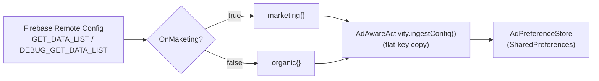
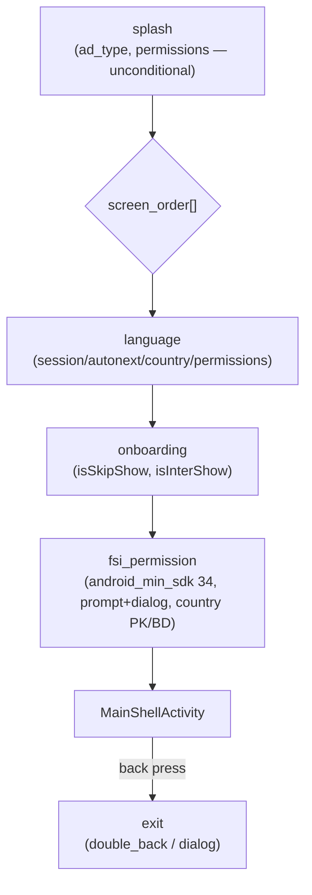

# Ads + Onboarding Dynamic Flow — Remote Config Spec

Single Firebase Remote Config JSON blob that drives ad behaviour, screen-wise
ad placement, and a fully dynamic onboarding flow (screen order, permissions,
country gating, exit behaviour) — **per audience** (`marketing` / `organic`).

> **Status: IMPLEMENTED.** The screen router, per-screen permissions,
> splash `ad_type`, managed exit, and the FSI/`AdPreferenceStore`/`NativeTheme`
> fixes below are live code (`compileDebugKotlin` and `assembleDebug` both
> pass). See §8 for exactly what changed, file by file, and the couple of
> gaps intentionally left unwired (documented there rather than silently
> skipped).

---

## 1. Overview

The app already ships one config blob per Remote Config key:

- `GET_DATA_LIST` — release builds
- `DEBUG_GET_DATA_LIST` — debug builds

Each key's value is a JSON object with two top-level audience buckets,
`marketing` and `organic`, selected at runtime by an install-referrer-derived
`OnMaketing` flag. This spec **extends** that existing blob — it does not add
a new Remote Config parameter.



---

## 2. Section map

Each audience object is organized into 8 groups (marked with `_group_*`
label keys in the JSON for readability in the Firebase console — those keys
are inert, the app ignores unknown keys):

| # | Group | Purpose |
|---|---|---|
| 1 | Ads On/Off + Type | Master ad switch, network selection (Google/Facebook) |
| 2 | Ads Counter | Per-format frequency throttles |
| 3 | Ad Id | AdMob / Facebook ad-unit IDs |
| 4 | **Api Config** | Lookup API base URL + endpoint paths — see §3.7 |
| 5 | ScreenWise Ads On/Off | Toggle for per-screen ad overrides |
| 6 | ScreenWise Ad Id | Per-screen banner/native id+type (`ScreenAds`) |
| 7 | **Onboarding Dynamic Flow** | `screen_order`, `screen`, `exit` — see §4 |
| 8 | Other | Links, HD_VBC, theme, custom ad card |

Groups 1–3, 5–6 and 8 are unchanged from the app's existing config surface.
Group 7 is new and **replaces** the old `intro_display` and
`permission_engine` blocks (removed — see §7 for why). Group 4 is new and
moves previously-hardcoded endpoints into config (credentials stay out — §3.7).

---

## 3. Groups 1–5 and 7 — field reference

### 3.1 Ads On/Off + Type

| Key | Type | Meaning |
|---|---|---|
| `IsAdsON` | Boolean | Master ad kill-switch. |
| `IsAdType` | String | `"Google"` or `"Facebook"` — global ad network selector. |

### 3.2 Ads Counter

Each counter is an integer throttle: an in-memory call counter
(`DisplayCadenceManager`) increments on every ad request; the ad only shows once
the counter reaches the configured value, then resets to 0.

| Key | Throttles |
|---|---|
| `InterCounter` | Standard interstitial |
| `InterBackCounter` | Back-press interstitial |
| `NativeCounter` | Native ad |
| `MidNativeCounter` | Mid-native ad |
| `BannerCounter` | Banner ad |
| `AppopenCounter` | App-open ad (stored, **not currently read** by `AppOpenAdManager`) |

### 3.3 Ad Id

| Key | Network | Format |
|---|---|---|
| `googleInter`, `googleS_Inter`, `googleBackInter`, `googleNative`, `googleBanner`, `googleAppopen`, `googleRewarded` | Google | AdMob ad-unit id |
| `faceB_InterAds`, `faceB_NativeAds`, `faceB_NativeBannerAds`, `faceB_BannerAds` | Facebook | `<template>#<placement_id>` |

> All Google IDs currently ship as **AdMob test IDs**
> (`ca-app-pub-3940256099942544/...`). Facebook IDs and `FbAppId`/
> `FbClientToken` are dummy placeholders. **Must be replaced before
> production release.**

### 3.4 ScreenWise Ads On/Off

| Key | Meaning |
|---|---|
| `screen_wise_ad` | If `false`, all screens use the global `googleBanner`/`googleNative` id (per-screen `show` from `ScreenAds` still applies). If `true`, per-screen overrides in `ScreenAds` take effect. |
| `screen_wise_default` | If `true` (and `screen_wise_ad=true`), every screen uses `ScreenAds.default` instead of its own named entry. |

### 3.5 ScreenWise Ad Id (`ScreenAds`)

Keyed by the exact Kotlin **Activity class name** — `BaseActivity.kt:128` calls
`ScreenPlacementPlan.showAd(this::class.java.simpleName, ...)`, so a key that doesn't
match a real `simpleName` never resolves. Resolution is Activity-only; there's
no Fragment-level granularity today. Each entry:

| Field | Type | Meaning |
|---|---|---|
| `show` | Boolean | Show ads on this screen at all. |
| `banner` | String | Banner ad-unit id (blank → inherits `googleBanner`). |
| `bannerType` | String | `"adaptive"` \| `"collapsible"` |
| `native` | String | Native ad-unit id (blank → inherits `googleNative`). |
| `nativeType` | String | `"small"` \| `"mid"` |

Current entries: `default`, `LanguagePickerActivity`, `MainShellActivity`.

> **Fixed a stale-key bug**: the JSON originally had `LanguageActivity` and
> `MainActivity` — neither is a real class in this codebase (verified against
> `find ... | xargs grep "^class.*Activity"`). The real classes, confirmed to
> extend `BaseActivity`, are `LanguagePickerActivity` (language screen) and
> `MainShellActivity` (home shell). A third original key, `HomeFragment`, was
> **dropped** — it never resolves (screen-name resolution is Activity-only)
> and there's no such class; `MainShellActivity`'s own entry already covers
> Home. If per-tab ad control (`CallLogFragment`, `ContactListFragment`,
> `BlockedNumbersFragment`, `ToolboxFragment`, `NumberFinderFragment`) is wanted
> later, `BaseActivity`/`ScreenPlacementPlan` need Fragment-level resolution added —
> that's a code change, not a JSON one.

> **Gap:** `ScreenAds` has no field to override `IsAdType` (Google vs
> Facebook) per screen — the network is still 100% global. Not yet added;
> flag if needed.

### 3.6 Other

Links (`DirectLink`, `PrivacyPolicy`, `TermLink`), country-counter gate
(`Iscountry_Counter`, `CountryList_Counter_NShow`), HD_VBC promo block,
`NativeTheme` (OS light/dark button/text/bg colors — see note below),
`custom_ads` (house ad card).

**What `Iscountry_Counter` / `CountryList_Counter_NShow` actually gates:**
IP-geolocation (matched against `RegionDetails.country`/`regionName`/`city` — **full
names**, e.g. `"India"`/`"Indore"`, not the ISO code used elsewhere — see
§4.3) sets `HD_VBC_Show=false` when the location is in the allow-list. That
one flag then gates two things:

- **`phone_state` permission row** in the Access sheet (`PermissionSheetDialog.kt:174`)
- **The Callback (post-call) screen** — `CallStateReceiver.kt:161` skips it
  entirely (`AppOpenAdManager.callbackshow`, `FloatingWidgetManager.presentCallbackScreen()`)
  when `HD_VBC_Show=false`

It gates the **overlay** permission ask too. Overlay permission is only used
*inside* the already-gated Callback screen (to pick a floating-bubble vs.
full-screen-notification display), so asking for it when the Callback screen
can never appear was pointless — that row used to be added unconditionally and
is now wrapped in the same `HD_VBC_Show` check as `phone_state` right above it
(`PermissionSheetDialog.kt` ~189-192). See §8.

### 3.7 `api_config` — lookup API endpoints

Drives the callerid.kpeworld.com calls in `NumberLookupService` (parsed by `EndpointConfig.kt`).
Lives **inside each audience block**, like every other key — `ingestConfig()`
only ever sees the resolved audience object, so put the **same value in both**
`marketing` and `organic` unless you genuinely want them on different backends.

| Field | Fallback | Meaning |
|---|---|---|
| `lookup_base_url` | `https://callerid.kpeworld.com/` | Retrofit base URL. A missing trailing slash is added automatically. |
| `lookup_api_id` | `CredentialProvider.API_ID` (local.properties) | Account path id for the lookup endpoint. |
| `lookup_path_similar` | `api/similar-phone-number/` | Number-lookup path; `lookup_api_id` is appended. |
| `lookup_path_save_contact` | `/api/save_contact2` | Contact-upload path. |

Every field falls back to the previously-hardcoded value, and a **blank** string
falls back too — so an absent, malformed, or not-yet-fetched `api_config` leaves
behaviour exactly as it was. That fallback is what runs on a first cold launch,
since Remote Config arrives asynchronously.

> **Credentials are deliberately NOT here.** `hash_key` and the bearer token stay
> in `local.properties` → obfuscated `BuildConfig` (`CredentialProvider`). Remote Config
> is **publicly readable** — the whole payload can be fetched over HTTPS using
> only the values in `google-services.json`, with no authentication. Putting auth
> material in RC would make it *easier* to obtain than decompiling the APK. See
> docs/credentials.md.

> **Base URL applies from the next cold start.** Retrofit fixes its base URL when
> the client is first built; the paths (`@Url`) are read per call. A domain
> migration therefore takes effect on the following launch.

### 3.8 `rate_us` — in-app review prompt on Home

Gates the Play **In-App Review** sheet shown on Home. Lives inside each audience
block. Distinct from the pre-existing `is_rateus`, which gates the *manual*
"Rate us" row in Settings — see the note below on why the two must stay apart.

| Field | Meaning |
|---|---|
| `isEnable` | Master switch for the automatic prompt. |
| `prompt_session` | Cadence **mode**: `always` \| `once` \| `sessions` \| `days` (table below). |
| `prompt_interval` | The **N** for that mode — app sessions when `sessions`, days when `days`. Ignored by `always` / `once`. |
| `min_sessions` | Floor for the **first** prompt. Google's first guideline is to ask only once the user "has experienced enough of your app to provide useful feedback"; in `days` mode the ledger is empty on day one, so the cadence alone would fire on the first Home visit. |
| `max_show_count` | Lifetime cap on **attempts** (see the quota note). |
| `is_screenListCountryCheck` / `screen_excluded_countries` | Same country gate shape as `screen.*` and `exit`. |

#### `prompt_session` modes

| `prompt_session` | `prompt_interval` | Meaning | Ledger it reads |
|---|---|---|---|
| `"always"` | ignored | Every session. | — |
| `"once"` | ignored | Only the first time, ever. | `introShownCount("rate_us") == 0` |
| `"sessions"` | N | Every Nth app session. | `appLaunchCount % N == 0` |
| `"days"` | N | At most once every N days. | `introLastShownMs("rate_us")` |

This is a **mode + interval** pair, matching the shape of the retired
`intro_display` block (`prompt_frequency` + `prompt_interval`) rather than the
single packed string `screen.<key>.session` uses (`"3"`, `"7d"`). Two fields are
more readable in the Firebase console — `"days"` + `3` says what it means, where
`"3d"` needs the grammar explained — at the cost of `rate_us` not sharing
`sessionGatePasses()`. That gate is ~12 lines; the duplication is cheap and the
console clarity is worth it.

#### Deliberately not in the config

Four fields were cut to keep this block short. Three became fixed behaviour in
code — they are tuning knobs nobody changes per-audience, and a config field
that is never edited is just another thing to keep in sync:

| Cut | Now |
|---|---|
| `min_sessions` | Redundant with `prompt_interval`; the one case it covered (`appLaunchCount == 0` on a Splash-less cold start) is a guard in the gate instead. |
| `reset_on_app_update` | Always on. Re-arm `max_show_count` whenever `versionCode` changes — there is no sane reason to want a user silenced forever across every future release. |
| `delay_after_queue_ms` | Fixed constant. The prompt waits for Home's queue (permission sheet, FSI dialog) to clear, then a short delay — sequencing, not a number worth publishing. |
| `min_days_since_install` | **Genuinely dropped** — see below. |

> **The one real loss is the day floor.** With `prompt_session: "sessions"`
> nothing stops a user reaching session 3 within an hour of installing and being
> asked to rate an app they have barely used. If that matters, switch the mode to
> `"days"` — `"days"` + `2` gives elapsed-time pacing instead. You cannot have
> both axes at once in this shape; that is the price of the shorter block.

> **Two traps in the OTHER `session` fields** (`screen.language`,
> `onboarding`, `fsi_permission`, `permission_sheet`) — `rate_us` avoids both by
> using explicit modes, but they still apply everywhere else:
>
> 1. `sessionGatePasses()` ends in `else -> true`, so any unrecognised value
>    **passes every session**. `session: "never"` therefore does the exact
>    opposite of what it reads. Use `isEnable: false` to switch a screen off.
> 2. `"<N>"` checks `appLaunchCount % N == 0`, and `0 % N == 0` is true.
>    `SplashActivity` bumps the counter to 1 before any gate runs so the normal
>    path is safe, but a cold start that reaches a screen without going through
>    Splash (a push-launched entry) is not.
>
> Both are one small guard in `sessionGatePasses()`.

**Cadence vs floors.** `session` is *how often to repeat*; `min_sessions` and
`min_days_since_install` are *the earliest a prompt is allowed at all*. They are
different questions, so they stay separate fields — a `session` of `"3"` with a
`min_sessions` of 3 means "not before session 3, then every 3rd session".

> One deliberate limitation of reusing the shared grammar: `session` is
> **either** session-based **or** day-based, not both — `"3"` and `"7d"` are
> alternatives. An earlier draft of this block had `session_interval` *and*
> `day_interval` ANDed together, which is stricter, but it invented a second
> cadence concept for one feature. If a combined cadence turns out to matter,
> extend `sessionGatePasses()` once and every screen gains it.

> **`max_show_count` counts attempts, not impressions.** Google's In-App Review
> API is quota-limited per user, and it deliberately gives the app **no signal**
> about whether the sheet was actually shown — `launchReviewFlow` reports success
> whether it displayed or silently no-opped. So this cap bounds how often we *ask*
> Play, not how many review sheets a user sees.

> **Why `days`/30 and not `sessions`/N.** The official guidance
> ([developer.android.com/guide/playcore/in-app-review](https://developer.android.com/guide/playcore/in-app-review))
> states the quota is *time-bound*, and that calling `launchReviewFlow` more than
> once "within a short period of time (for example, less than a month)" may show
> nothing at all. A session cadence ignores that clock: with `sessions`/3 an
> active user hits all three attempts inside a week, and Play would surface at
> most one sheet — the other two are silently discarded. Pacing on days lines the
> retry up with the quota window instead. The exact quota is an implementation
> detail Google can change, so treat 30 as "roughly the window", not a contract.

> **Compliance, verified in this app.** The docs forbid a call-to-action button
> that triggers the API ("users might have hit their quota, creating a broken
> experience — redirect to the Play Store instead"). The Settings **Rate us** row
> calls `DisplayUtils.rateApp()`, which opens `market://details?id=…` with a web
> fallback, and never touches `ReviewManager`; `AppRatingPrompt` is the only file in
> the app that references the review API at all. The other prohibitions — no
> pre-prompt question, no restyling, overlaying or programmatically dismissing the
> card — are satisfied by construction, since nothing here draws its own UI.

> **Keep `rate_us` and `is_rateus` separate.** Google's policy is that the in-app
> review flow must not be triggered by a button ("Rate us" in Settings should open
> the store listing instead). `is_rateus` therefore stays the switch for that
> manual row; `rate_us` drives only the automatic Home prompt.

Two legacy dual-key pairs were **collapsed to a single key** now that the
audience split happens at the top level (`marketing{}`/`organic{}`) — each
audience block only ever needs its own value, not a second "Market"-prefixed
variant of the same key:

| Removed | Kept | Code note |
|---|---|---|
| `MarketLink` | `DirectLink` | Not needed in a split config — the `MarketLink → DirectLink` copy in `AdAwareActivity.kt` is gated `if (isMarketingOn && !isSplitConfig)`, so it never runs for one. **`MarketLink` still has to stay in the `ingestConfig()` whitelist**, though: dropping it while leaving the copy in place meant a legacy *flat* config would blank `DirectLink` (which drives the house-ad click-through) for the marketing audience. The copy is now additionally guarded on a non-blank value. See §8. |
| `Iscountry_Marketing_Counter`, `CountryList_Marketing_Counter_NShow` | `Iscountry_Counter`, `CountryList_Counter_NShow` | **Not yet safe** — `AdAwareActivity.kt:462-465` picks between the two key names based on `isMarketingOn` *without* an `!isSplitConfig` guard (unlike the counter-copy block right below it). Needs the same guard added, or it'll silently read a missing key for the marketing audience. See §8. |

> `NativeTheme.default.{NativeLight,NativeDark}` was **not** touched —
> `NativeLight`/`NativeDark` select the *phone's* OS light/dark mode
> (`resolveNativeThemeKey()`), not the audience. Audience is already handled
> by being inside `marketing{}`/`organic{}` at the top level; that both
> variants currently carry the same color per audience is coincidental, not
> structural — they can be differentiated later. See §8 for a related code
> gap in `applyNativeTheme()`.

See the full JSON in §9.

---

## 4. Group 6 — Onboarding Dynamic Flow

### 4.1 `screen_order`

```json
"screen_order": ["language", "onboarding", "fsi_permission"]
```

An **ordered array of screen keys**. This array — not hardcoded Kotlin — is
meant to be the single source of truth for onboarding sequence. `splash` is
implicit and always first (not listed); any key present must have a matching
entry in `screen{}`.

> Removed from an earlier draft: `terms` (not needed) and `overlay_permission`
> (dropped — no such screen exists in the app, would have needed new code to
> build a "draw over other apps" ask).

### 4.2 `screen.splash`

Not part of `screen_order` — always runs first, unconditionally.

| Field | Type | Meaning |
|---|---|---|
| `ad_type` | String | `"app_open"` \| `"inter"` \| `"none"` — what ad splash shows. Replaces the old two-boolean (`is_splash_ads` + `is_splash_inter_show`) combination. |
| `banner_ad` | Object | `{ show, id, type }` — optional bottom banner on splash. Blank `id` inherits `googleBanner`. |
| `permissions` | Array | See §4.5. Splash's permission list has no `isEnable`/`session` gate of its own — it always fires (subject to each permission's own country check). |

### 4.3 `screen.<key>` (language, onboarding, fsi_permission)

| Field | Type | Meaning |
|---|---|---|
| `isEnable` | Boolean | Screen on/off. |
| `session` | String | `"once"` \| `"every"` \| `"<N>"` (numeric string = show every N app sessions). |
| `autonext` | Int | Seconds before auto-advancing to the next screen. `0` = disabled (user must interact). |
| `isSkipShow` | Boolean | Show a "Skip" affordance (omitted on `language` — no skip, only autonext/back). |
| `is_screenListCountryCheck` | Boolean | Enable country gating for this screen. |
| `screen_excluded_countries` | Array\<String\> | ISO country codes excluded when the check above is `true`. |
| `onBackPerformNext` | Boolean | Does system back-press advance to the next screen (`true`) or exit the flow / go back a screen (`false`)? |
| `isInterShow` | Boolean | Show an interstitial when leaving this screen. |
| `isBottomAds` | Boolean | Show a bottom ad slot on this screen. |
| `isBottomAdsType` | String | `"BigNative"` \| `"MediumNative"` \| `"SmallNative"` \| `"Banner"` (casing must match exactly if parsed as a Kotlin `enum` / string-switch). |
| `permissions` | Array | See §4.5. Empty array = no runtime permission requested on this screen. |

### 4.4 `screen.fsi_permission` — extra fields

The FSI (full-screen-intent) screen carries additional fields, migrated
1:1 from the old `permission_engine.fullscreen_permission` block:

| Field | Type | Meaning |
|---|---|---|
| `android_min_sdk` | Int | `34` — FSI priming only applies Android 14+. |
| `prompt` | Object | `{ title, desc, button }` — copy for the full-screen priming **screen**. |
| `dialog` | Object | `{ isEnable, delay_ms, show_after_days, max_show_count, title, desc, button }` — copy/timing for the secondary **dialog** nudge (shown after `show_after_days` days if the user hasn't enabled FSI from the screen). |

Marketing vs organic copy/timing differs (see §6).

### 4.5 `permissions[]` (used inside every screen entry)

```json
{ "is_permissionListCountryCheck": false, "permission_excluded_countries": ["IN"], "permission_name": ["android.permission.POST_NOTIFICATIONS"] }
```

| Field | Type | Meaning |
|---|---|---|
| `is_permissionListCountryCheck` | Boolean | Enable country gating for *this specific permission ask*. |
| `permission_excluded_countries` | Array\<String\> | ISO codes excluded when the check is `true`. |
| `permission_name` | Array\<String\> | Android permission constant(s) requested together (e.g. `android.permission.POST_NOTIFICATIONS`). |

Each screen can request multiple permission entries; each entry has its own
independent country gate.

### 4.6 `exit`

Sits alongside `screen_order`/`screen`, not inside it — exit is a Home-level
behaviour, not a sequenced screen.

| Field | Type | Meaning |
|---|---|---|
| `isEnable` | Boolean | Master on/off for managed exit behaviour. |
| `exitType` | String | `"double_back"` \| `"dialog"`. |
| `doubleBackIntervalSec` | Int | Window for the double-back-to-exit gesture. |
| `doubleBackToastText` | String | Toast shown on first back-press when `exitType="double_back"`. |
| `isInterShow` | Boolean | Show an interstitial before actually exiting. |
| `isBottomAds` / `isBottomAdsType` | Bool / String | Ad slot on the exit surface (if `exitType="dialog"`). |
| `is_screenListCountryCheck` / `screen_excluded_countries` | Bool / Array | Country gate for exit behaviour itself. |
| `dialog` | Object | `{ isEnable, title, desc, positiveButton, negativeButton, isNativeAdShow, isBottomAdsType }` — used only when `exitType="dialog"`. |

### 4.7 `screen.permission_sheet`

Not part of `screen_order` (it's not a sequenced screen) — the Home
permission bottom sheet's auto-show gate (`PermissionSheetDialog.shouldAutoShow()`).
Only `isEnable` and `session` are read; the rest of the shared `screen.<key>`
shape doesn't apply here.

| Field | Type | Meaning |
|---|---|---|
| `isEnable` | Boolean | Master on/off for the sheet auto-popping on launch. A manual "Manage" tap ignores this and always opens. |
| `session` | String | `"once"` \| `"every"` \| `"<N>"` (every N launches) \| `"<N>d"` (every N **days** — e.g. `"3d"`). |

---

## 5. Screen flow diagram



`screen_order` in the current spec is `["language", "onboarding",
"fsi_permission"]` for **both** audiences — each screen's own `isEnable` /
`session` / country-gate still decides whether it actually shows at runtime.

---

## 6. Marketing vs Organic — behavioural differences

| Aspect | Marketing | Organic | Why (as configured) |
|---|---|---|---|
| `language.session` | `once` | `every` | Marketing users see language picker once; organic re-shown every session. |
| `language.autonext` | 10s | 50s | Marketing auto-advances faster. |
| `language.onBackPerformNext` | `true` | `false` | Marketing lets back-press skip forward; organic does not. |
| `onboarding.isInterShow` | `true` (both) | `true` (both) | Same — inter shown leaving onboarding either way. |
| `fsi_permission` copy | "Never miss who's calling…" / "Enable full-screen call alerts" | "Stay ahead of every call…" / "Turn on call alerts" | Different tone/wording per audience. |
| `fsi_permission.dialog.show_after_days` | 3 | 7 | Marketing re-nudges sooner. |
| `exit.exitType` | `dialog` (+ native ad, `isInterShow:true`) | `double_back` (no ads) | Marketing monetizes the exit path; organic keeps it friction-free. |
| `IsBack` | `true` | `false` | Pre-existing flag: marketing shows an interstitial on generic back-press; organic doesn't. |
| `is_rateus` | `false` | `true` | Organic prompts for a store rating; marketing doesn't. |

---

## 7. What was removed, and why

| Removed | Replaced by | Reason |
|---|---|---|
| `intro_display` (`language`/`terms`/`onboarding`/`permission_sheet`, each with `enabled`+`prompt_frequency`+`prompt_interval`) | `screen{}` | New schema is a strict superset (adds country-gate, autonext, back-behaviour, ads, permissions per screen). Keeping both would create two independent "when do I show this screen" decisions with no defined precedence. |
| `permission_engine` (`notification`/`phone_state`/`fullscreen_permission`) | `screen.<key>.permissions[]` (+ `screen.fsi_permission.{android_min_sdk,prompt,dialog}`) | Same reasoning — permission timing/priority is now attached directly to the onboarding screen that requests it, instead of a separate priority-ordered engine. |
| `is_splash_ads`, `is_splash_inter_show` | `screen.splash.ad_type` | Two overlapping booleans collapsed into one 3-way enum (`app_open`/`inter`/`none`). |
| `terms` screen | — (dropped entirely) | Confirmed not needed. |
| `overlay_permission` screen | — (dropped entirely) | No such screen/Activity exists in the app; would require new code with no current spec. Confirmed out of scope. |
| `firstLaunch` (top-level bool per audience) | — (dropped entirely) | Ambiguous vs. per-screen `session` — confirmed not needed. |

---

## 8. Implementation status

`./gradlew :app:compileDebugKotlin` and `:app:assembleDebug` both pass with
these changes in place.

### Done

| File | What changed |
|---|---|
| `numberlookup/screen/gate/OnboardingStepConfig.kt` (**new**) | Parses `screen_order`/`screen.<key>`/`exit` from `AdPreferenceStore`; `isEligible()` (isEnable + session `once`\|`every`\|`<N>`\|`<N>d` + country gate, `fsi_permission` deferred to `LockScreenPermission`), `nextEligibleAfter()`/`firstEligible()` (the router), `classFor()`, `markShown()`. Replaces `IntroGateConfig.kt`/`IntroGatePolicy.kt` (**deleted**). |
| `numberlookup/screen/launch/SplashActivity.kt` | `nextScreen()` now calls `OnboardingStepConfig.firstEligible()`; dead `route()` deleted. |
| `numberlookup/screen/locale/LanguagePickerActivity.kt` | `onContinue()` uses `PermissionCoordinator.checkScreenPermissions(this, "language")`, routes via `nextEligibleAfter("language")`, gates the interstitial on `screen.language.isInterShow`. The back-press "advance like Continue" callback now only registers when `onBackPerformNext=true`. Dropped its own Terms/Onboarding/FSI-wrap logic entirely — the router owns that. |
| `numberlookup/screen/welcome/IntroActivity.kt` | `finishOnboarding()` same pattern: `checkScreenPermissions(this, "onboarding")`, routes via `nextEligibleAfter("onboarding")` instead of hardcoding `MainShellActivity`, gates the interstitial on `isInterShow`. |
| `numberlookup/access/PermissionCoordinator.kt` (+ `PermissionUtils.kt`) | New `checkScreenPermissions(activity, screenKey, onComplete)` — reads `screen.<screenKey>.permissions[]`, applies each entry's own country gate, resolves `permission_name` → `PermissionSpec` via new `PermissionUtils.specForAndroidPermission()` (matches `CATALOG` by `androidPermission`; same extension model as the rest of the engine — add a `CATALOG` line for a permission string that isn't there yet). Reuses `PermissionRequestQueue`/`PermissionScheduler`/`PermissionLauncher` unchanged. The old Activity-name-matched `check()`/`request()` are untouched and still used by `PermissionSheetDialog`'s Home-level rows (see below). |
| `access/fullscreen/LockScreenConfig.kt` | Reads `screen.fsi_permission` instead of `permission_engine.fullscreen_permission` (same direct-RC-read + `audienceRoot()` pattern). Field mapping: `isEnable`→`enabled`/`Screen.enabled`, `session=="once"`→`Screen.showOnce`, `prompt.*`→`Screen` copy, `is_screenListCountryCheck`/`screen_excluded_countries`→country gate, `dialog.*` 1:1 (`delay_ms`, `show_after_days`, `max_show_count`). Dropped the inner `organic{}` override (redundant now the outer split already resolves audience) and the unused `screen`/`dialog` `priority`/screen `delay` fields (confirmed dead in `LockScreenPermission.kt` — never read). |
| `access/fullscreen/LockScreenAlertActivity.kt` | Drops `EXTRA_NEXT`/`pendingNext`/`newIntent(context, next)` entirely — `continueToNext()` now computes `OnboardingStepConfig.nextEligibleAfter(this, "fsi_permission")` fresh each time (works identically whether the instance was reused or recreated across the Settings round-trip). The "Enable" button primes via `PermissionCoordinator.checkScreenPermissions(this, "fsi_permission")` instead of the hardcoded `request(this, "notification")`. |
| `adkit/runtime/AdAwareActivity.kt` | **Splash ad gate + `warmUpAds()`**: reads `OnboardingStepConfig.splashConfig(activity).adType` (`"none"` skips the splash ad entirely; `"inter"` loads the interstitial; else App Open) instead of `is_splash_ads`/`is_splash_inter_show`. **`ingestConfig()` whitelist**: removed `is_splash_ads`, `is_splash_inter_show`, `intro_display`, `Iscountry_Marketing_Counter`, `CountryList_Marketing_Counter_NShow`, the never-read `Perm_Sheet_Show`/`Perm_Sheet_Mode`, and the never-read `Perm_Sheet_Interval_Days` (the permission sheet's cadence is now `screen.permission_sheet.session`); added `screen`, `exit`, `screen_order` (array, stored as text like the objects). `MarketLink` was removed here too at first and has since been **restored** — see §3.6. **`funOnAdsLoad()` country-counter keys** (was line 462-465): now gated `!isSplitConfig && isMarketingOn` — matches the guard the counter-copy block already had, so a split config always reads the plain `Iscountry_Counter`/`CountryList_Counter_NShow`. **`applyNativeTheme()`**: `marketingObj` now falls back to `defaultObj` when there's no nested `"marketing"` key (the split-config case) — previously resolved to `{}` and silently dropped theme colors for the marketing audience. |
| `screen/MainShellActivity.kt` (`handleBack()`) | Reads `exit.*` via `OnboardingStepConfig.exitConfig()`. `exitType="dialog"` (+ `dialog.isEnable`) and country-allowed → `MaterialAlertDialogBuilder` with the configured title/desc/button text; Exit optionally fronts an interstitial (`isInterShow`) before `exitToHome()`. Otherwise (or when disabled/country-excluded) falls back to the original double-back-within-`doubleBackIntervalSec`-toast behaviour, using the configured interval/text when managed, or the original hardcoded 2s/string resource as a safe default. |
| `numberlookup/access/PermissionSheetDialog.kt` | **Newly discovered consumer, not in the original checklist**: the Home permission sheet's auto-show gate used `IntroGateConfig.PERMISSION_SHEET`/`IntroGatePolicy.shouldShowPermissionSheet()` against `intro_display.permission_sheet` — which had no equivalent in the new schema, and would have broken once `intro_display` was removed. Added `screen.permission_sheet: {isEnable, session}` to the schema (§6.1) and pointed `shouldAutoShow()`/`show()` at `OnboardingStepConfig.isEligible/markShown(..., PERMISSION_SHEET_KEY)`. |
| `numberlookup/screen/consent/` — Terms flow (**deleted**) | The `terms` screen was dropped from the schema (§7) and isn't in `screen_order`, leaving `ConsentActivity.kt`, `BubbleAccessActivity.kt` and `BubbleWatchService.kt` unreachable. All three are now deleted, along with their layouts (`screen_terms.xml`, `screen_overlay_permission.xml`) and their three `<activity>`/`<service>` manifest entries. `OverlayPermissionUtils.kt` **stays** — `PermissionSheetDialog` and `MainShellActivity` still use it for the overlay permission check/intent. Overlay grant polling lives in `MainShellActivity.startOverlayPermissionFlow()` (a main-thread Handler poll), which is what `BubbleWatchService` had already been superseded by. |
| `LanguagePickerActivity.kt` / `IntroActivity.kt` / `LockScreenAlertActivity.kt` — `autonext` | Nothing read `autonext`. | Each screen now schedules a `Handler.postDelayed(autonextSec * 1000L)` that fires the same action as Continue/Skip (idempotent — guarded by the existing `forwarding`/`navigated` one-shot flags, now also covering the Continue/Skip button taps, not just back-press). `LockScreenAlertActivity` additionally cancels its autonext the moment "Enable Now" is tapped, so it can't fire out from under the user while they're away on the system Settings page. Cancelled in each Activity's `onDestroy()`. |
| `AdAwareActivity.kt` `primeSplashPermissions()` | Manually chained `PermissionCoordinator.request()` for `"notification"`→`"phone_state"`, gated by `targetsScreen()` against the old `permission_engine` rules (working only via `PermissionRepository`'s compiled-in fallback once `permission_engine` was removed). `targetsScreen()`/the `PermissionRepository` import are now dead. | Replaced with a single `PermissionCoordinator.checkScreenPermissions(activity, "splash")` call — reads `screen.splash.permissions[]` directly, gets the per-permission country gate for free. `targetsScreen()` deleted; unused `PermissionRepository` import removed. |
| `PermissionSheetDialog.kt` `buildRows()` — `overlay` row | Added unconditionally. | Now wrapped in the same `HD_VBC_Show` check as `phone_state`, matching the Callback screen's gate. |

### Still not wired

- **`isBottomAds`/`isBottomAdsType`** (a bottom ad slot on language/onboarding/fsi_permission) is parsed into `OnboardingStepConfig.ScreenStep` but nothing renders it — needs a new ad container added to layouts that don't have one today, which is real UI work, not config plumbing.
- **Per-screen `IsAdType` override** (§5 gap) and **`isSkipShow`** (IntroActivity's Skip button is already unconditionally visible, matching the current `true` value in both audiences) — no code change needed for the current JSON values.

---

## 9. Full JSON

See the current draft: it ships alongside this document as the value to
paste into both `GET_DATA_LIST` and `DEBUG_GET_DATA_LIST` in the Firebase
Remote Config console once implementation lands.

```json
{
  "marketing": {
    "_group_AdsOnOff_AdType": "----- Ads ON/OFF + Ad Network Type -----",
    "IsAdsON": true,
    "IsAdType": "Google",

    "_group_AdsCounter": "----- Ads Counter (throttle: show after N calls) -----",
    "InterCounter": 0,
    "InterBackCounter": 0,
    "NativeCounter": 0,
    "MidNativeCounter": 0,
    "BannerCounter": 0,
    "AppopenCounter": 0,

    "_group_AdId": "----- Ad Unit IDs: Google then Facebook -----",
    "googleInter": "ca-app-pub-3940256099942544/1033173712",
    "googleS_Inter": "ca-app-pub-3940256099942544/1033173712",
    "googleBackInter": "ca-app-pub-3940256099942544/1033173712",
    "googleNative": "ca-app-pub-3940256099942544/2247696110",
    "googleBanner": "ca-app-pub-3940256099942544/9214589741",
    "googleAppopen": "ca-app-pub-3940256099942544/9257395921",
    "googleRewarded": "ca-app-pub-3940256099942544/5224354917",
    "faceB_InterAds": "IMG_16_9_APP_INSTALL#YOUR_PLACEMENT_ID",
    "faceB_NativeAds": "IMG_16_9_APP_INSTALL#YOUR_PLACEMENT_ID",
    "faceB_NativeBannerAds": "IMG_16_9_APP_INSTALL#YOUR_PLACEMENT_ID",
    "faceB_BannerAds": "IMG_16_9_APP_INSTALL#YOUR_PLACEMENT_ID",

    "_group_ApiConfig": "----- Lookup API endpoints (no credentials here) -----",
    "api_config": {
      "lookup_base_url": "https://callerid.kpeworld.com/",
      "lookup_api_id": "1433",
      "lookup_path_similar": "api/similar-phone-number/",
      "lookup_path_save_contact": "/api/save_contact2"
    },

    "_group_ScreenWiseToggle": "----- ScreenWise Ads ON/OFF -----",
    "screen_wise_ad": false,
    "screen_wise_default": false,

    "_group_ScreenWiseAdId": "----- ScreenWise Ad IDs, keyed by screen name -----",
    "ScreenAds": {
      "default": {
        "show": true,
        "banner": "ca-app-pub-3940256099942544/9214589741",
        "bannerType": "adaptive",
        "native": "ca-app-pub-3940256099942544/2247696110",
        "nativeType": "mid"
      },
      "LanguagePickerActivity": {
        "show": true,
        "banner": "ca-app-pub-3940256099942544/9214589741",
        "bannerType": "adaptive",
        "native": "ca-app-pub-3940256099942544/2247696110",
        "nativeType": "mid"
      },
      "MainShellActivity": {
        "show": false,
        "banner": "ca-app-pub-3940256099942544/9214589741",
        "bannerType": "adaptive",
        "native": "ca-app-pub-3940256099942544/2247696110",
        "nativeType": "mid"
      }
    },

    "_group_OnboardingFlow": "----- Onboarding Dynamic Flow (replaces old intro_display + permission_engine) -----",
    "screen_order": ["language", "onboarding", "fsi_permission"],
    "screen": {
      "splash": {
        "ad_type": "app_open",
        "banner_ad": { "show": true, "id": "", "type": "adaptive" },
        "permissions": [
          { "is_permissionListCountryCheck": false, "permission_excluded_countries": ["IN"], "permission_name": ["android.permission.POST_NOTIFICATIONS"] },
          { "is_permissionListCountryCheck": false, "permission_excluded_countries": ["IN"], "permission_name": ["android.permission.READ_PHONE_STATE"] }
        ]
      },
      "language": {
        "isEnable": true, "session": "once", "autonext": 10,
        "is_screenListCountryCheck": false, "screen_excluded_countries": ["IN"],
        "onBackPerformNext": true, "isInterShow": false,
        "isBottomAds": true, "isBottomAdsType": "BigNative", "permissions": []
      },
      "onboarding": {
        "isEnable": true, "session": "every", "autonext": 0, "isSkipShow": true,
        "is_screenListCountryCheck": false, "screen_excluded_countries": ["IN"],
        "onBackPerformNext": false, "isInterShow": true,
        "isBottomAds": true, "isBottomAdsType": "MediumNative", "permissions": []
      },
      "fsi_permission": {
        "isEnable": true, "session": "every", "autonext": 0, "isSkipShow": true,
        "is_screenListCountryCheck": true, "screen_excluded_countries": ["PK", "BD"],
        "onBackPerformNext": true, "isInterShow": false,
        "isBottomAds": true, "isBottomAdsType": "Banner",
        "android_min_sdk": 34,
        "prompt": {
          "title": "Never miss who's calling",
          "desc": "Show verified caller details on your lock screen — the instant a call comes in.",
          "button": "Enable Now"
        },
        "dialog": {
          "isEnable": true,
          "delay_ms": 500,
          "show_after_days": 3,
          "max_show_count": 1,
          "title": "Enable full-screen call alerts",
          "desc": "Get a loud, full-screen heads-up for calls you can't miss.",
          "button": "Enable Now"
        },
        "permissions": [
          { "is_permissionListCountryCheck": false, "permission_excluded_countries": ["IN"], "permission_name": ["android.permission.POST_NOTIFICATIONS"] }
        ]
      },
      "permission_sheet": { "isEnable": true, "session": "every" }
    },
    "exit": {
      "isEnable": true,
      "exitType": "dialog",
      "doubleBackIntervalSec": 2,
      "doubleBackToastText": "Press back again to exit",
      "isInterShow": true,
      "isBottomAds": false,
      "isBottomAdsType": "Banner",
      "is_screenListCountryCheck": false,
      "screen_excluded_countries": ["IN"],
      "dialog": {
        "isEnable": true,
        "title": "Exit App?",
        "desc": "Are you sure you want to exit?",
        "positiveButton": "Exit",
        "negativeButton": "Cancel",
        "isNativeAdShow": true,
        "isBottomAdsType": "MediumNative"
      }
    },

    "_group_Other": "----- Everything else (unchanged) -----",
    "IsFail_FB": false,
    "IsCustomADS": false,
    "isLoaderForFB": false,
    "IsBack": true,
    "NativeBanner": true,
    "NativeAd": true,
    "BannerAds": true,
    "InterAds": true,
    "AppopenAds": false,
    "is_rateus": false,
    "is_preload_ads": true,
    "In_App_Update_Show": false,
    "In_App_Update_Force_Show": false,
    "In_App_Update_Link": "",
    "DirectLink": "https://980.mark.qureka.com/intro",
    "PrivacyPolicy": "https://privacypolicyportal.com/policy/identifycaller.phonelookup.contacts.calllog",
    "TermLink": "https://sites.google.com/view/calleridtermsand-consdtions/home",
    "Iscountry_Counter": true,
    "CountryList_Counter_NShow": "Indore",
    "HD_VBC_Show": true,
    "HD_VBC_Native": true,
    "HD_VBC_Type": "b",
    "HD_VBC_Hrs": 0,
    "HD_VBC_Native_ID": "ca-app-pub-3940256099942544/2247696110",
    "HD_VBC_Banner_ID": "ca-app-pub-3940256099942544/9214589741",
    "FbAppId": "dfgd",
    "FbClientToken": "fgfgfd",
    "NativeTheme": {
      "default": {
        "NativeLight": { "btnColor": "#2E7D32", "btnText": "#FFFFFF", "bgColor": "#FFFFFF", "textColor": "#000000" },
        "NativeDark": { "btnColor": "#2E7D32", "btnText": "#FFFFFF", "bgColor": "#121212", "textColor": "#FFFFFF" }
      }
    },
    "custom_ads": [
      {
        "icon": "https://appdata.blr1.digitaloceanspaces.com/pja/caller_id/Frame%201234570076.png",
        "title": "Identify Unknown Caller",
        "description": "See caller name, location and spam status before answering any call.",
        "bannerImage": "https://appdata.blr1.digitaloceanspaces.com/pja/caller_id/1.png",
        "buttonText": "Check Now"
      }
    ]
  },

  "organic": {
    "_group_AdsOnOff_AdType": "----- Ads ON/OFF + Ad Network Type -----",
    "IsAdsON": true,
    "IsAdType": "Google",

    "_group_AdsCounter": "----- Ads Counter (throttle: show after N calls) -----",
    "InterCounter": 0,
    "InterBackCounter": 0,
    "NativeCounter": 0,
    "MidNativeCounter": 0,
    "BannerCounter": 0,
    "AppopenCounter": 0,

    "_group_AdId": "----- Ad Unit IDs: Google then Facebook -----",
    "googleInter": "ca-app-pub-3940256099942544/1033173712",
    "googleS_Inter": "ca-app-pub-3940256099942544/1033173712",
    "googleBackInter": "ca-app-pub-3940256099942544/1033173712",
    "googleNative": "ca-app-pub-3940256099942544/2247696110",
    "googleBanner": "ca-app-pub-3940256099942544/9214589741",
    "googleAppopen": "ca-app-pub-3940256099942544/9257395921",
    "googleRewarded": "ca-app-pub-3940256099942544/5224354917",
    "faceB_InterAds": "IMG_16_9_APP_INSTALL#YOUR_PLACEMENT_ID",
    "faceB_NativeAds": "IMG_16_9_APP_INSTALL#YOUR_PLACEMENT_ID",
    "faceB_NativeBannerAds": "IMG_16_9_APP_INSTALL#YOUR_PLACEMENT_ID",
    "faceB_BannerAds": "IMG_16_9_APP_INSTALL#YOUR_PLACEMENT_ID",

    "_group_ApiConfig": "----- Lookup API endpoints (no credentials here) -----",
    "api_config": {
      "lookup_base_url": "https://callerid.kpeworld.com/",
      "lookup_api_id": "1433",
      "lookup_path_similar": "api/similar-phone-number/",
      "lookup_path_save_contact": "/api/save_contact2"
    },

    "_group_ScreenWiseToggle": "----- ScreenWise Ads ON/OFF -----",
    "screen_wise_ad": false,
    "screen_wise_default": false,

    "_group_ScreenWiseAdId": "----- ScreenWise Ad IDs, keyed by screen name -----",
    "ScreenAds": {
      "default": {
        "show": true,
        "banner": "ca-app-pub-3940256099942544/9214589741",
        "bannerType": "adaptive",
        "native": "ca-app-pub-3940256099942544/2247696110",
        "nativeType": "mid"
      },
      "LanguagePickerActivity": {
        "show": true,
        "banner": "ca-app-pub-3940256099942544/9214589741",
        "bannerType": "adaptive",
        "native": "ca-app-pub-3940256099942544/2247696110",
        "nativeType": "mid"
      },
      "MainShellActivity": {
        "show": false,
        "banner": "ca-app-pub-3940256099942544/9214589741",
        "bannerType": "adaptive",
        "native": "ca-app-pub-3940256099942544/2247696110",
        "nativeType": "mid"
      }
    },

    "_group_OnboardingFlow": "----- Onboarding Dynamic Flow (replaces old intro_display + permission_engine) -----",
    "screen_order": ["language", "onboarding", "fsi_permission"],
    "screen": {
      "splash": {
        "ad_type": "app_open",
        "banner_ad": { "show": true, "id": "", "type": "adaptive" },
        "permissions": [
          { "is_permissionListCountryCheck": true, "permission_excluded_countries": ["IN"], "permission_name": ["android.permission.POST_NOTIFICATIONS"] },
          { "is_permissionListCountryCheck": true, "permission_excluded_countries": ["IN"], "permission_name": ["android.permission.READ_PHONE_STATE"] }
        ]
      },
      "language": {
        "isEnable": true, "session": "every", "autonext": 50,
        "is_screenListCountryCheck": false, "screen_excluded_countries": ["IN"],
        "onBackPerformNext": false, "isInterShow": false,
        "isBottomAds": true, "isBottomAdsType": "BigNative", "permissions": []
      },
      "onboarding": {
        "isEnable": true, "session": "every", "autonext": 0, "isSkipShow": true,
        "is_screenListCountryCheck": false, "screen_excluded_countries": ["IN"],
        "onBackPerformNext": false, "isInterShow": true,
        "isBottomAds": true, "isBottomAdsType": "MediumNative",
        "permissions": [
          { "is_permissionListCountryCheck": true, "permission_excluded_countries": ["IN"], "permission_name": ["android.permission.POST_NOTIFICATIONS"] },
          { "is_permissionListCountryCheck": true, "permission_excluded_countries": ["IN"], "permission_name": ["android.permission.READ_PHONE_STATE"] }
        ]
      },
      "fsi_permission": {
        "isEnable": true, "session": "every", "autonext": 0, "isSkipShow": true,
        "is_screenListCountryCheck": true, "screen_excluded_countries": ["PK", "BD"],
        "onBackPerformNext": false, "isInterShow": false,
        "isBottomAds": false, "isBottomAdsType": "Banner",
        "android_min_sdk": 34,
        "prompt": {
          "title": "Stay ahead of every call",
          "desc": "See who's calling on your lock screen, even before you pick up.",
          "button": "Turn On"
        },
        "dialog": {
          "isEnable": true,
          "delay_ms": 500,
          "show_after_days": 7,
          "max_show_count": 1,
          "title": "Turn on call alerts",
          "desc": "Get a heads-up for calls you can't miss.",
          "button": "Turn On"
        },
        "permissions": [
          { "is_permissionListCountryCheck": false, "permission_excluded_countries": ["IN"], "permission_name": ["android.permission.POST_NOTIFICATIONS"] }
        ]
      },
      "permission_sheet": { "isEnable": true, "session": "3d" }
    },
    "exit": {
      "isEnable": true,
      "exitType": "double_back",
      "doubleBackIntervalSec": 2,
      "doubleBackToastText": "Press back again to exit",
      "isInterShow": false,
      "isBottomAds": false,
      "isBottomAdsType": "Banner",
      "is_screenListCountryCheck": false,
      "screen_excluded_countries": ["IN"],
      "dialog": {
        "isEnable": false,
        "title": "Exit App?",
        "desc": "Are you sure you want to exit?",
        "positiveButton": "Exit",
        "negativeButton": "Cancel",
        "isNativeAdShow": false,
        "isBottomAdsType": "MediumNative"
      }
    },

    "_group_Other": "----- Everything else (unchanged) -----",
    "IsFail_FB": false,
    "IsCustomADS": false,
    "isLoaderForFB": false,
    "IsBack": false,
    "NativeBanner": true,
    "NativeAd": true,
    "BannerAds": true,
    "InterAds": true,
    "AppopenAds": false,
    "is_rateus": true,
    "is_preload_ads": true,
    "In_App_Update_Show": false,
    "In_App_Update_Force_Show": false,
    "In_App_Update_Link": "",
    "DirectLink": "https://980.mark.qureka.com/intro",
    "PrivacyPolicy": "https://privacypolicyportal.com/policy/identifycaller.phonelookup.contacts.calllog",
    "TermLink": "https://sites.google.com/view/calleridtermsand-consdtions/home",
    "Iscountry_Counter": true,
    "CountryList_Counter_NShow": "Indore",
    "HD_VBC_Show": true,
    "HD_VBC_Native": true,
    "HD_VBC_Type": "b",
    "HD_VBC_Hrs": 0,
    "HD_VBC_Native_ID": "ca-app-pub-3940256099942544/2247696110",
    "HD_VBC_Banner_ID": "ca-app-pub-3940256099942544/9214589741",
    "FbAppId": "dfgd",
    "FbClientToken": "fgfgfd",
    "NativeTheme": {
      "default": {
        "NativeLight": { "btnColor": "#1565C0", "btnText": "#FFFFFF", "bgColor": "#FFFFFF", "textColor": "#000000" },
        "NativeDark": { "btnColor": "#1565C0", "btnText": "#FFFFFF", "bgColor": "#1C1F31", "textColor": "#FFFFFF" }
      }
    },
    "custom_ads": [
      {
        "icon": "https://appdata.blr1.digitaloceanspaces.com/pja/caller_id/Frame%201234570076.png",
        "title": "Identify Unknown Caller",
        "description": "See caller name, location and spam status before answering any call.",
        "bannerImage": "https://appdata.blr1.digitaloceanspaces.com/pja/caller_id/1.png",
        "buttonText": "Check Now"
      }
    ]
  }
}
```

> Ad-unit IDs and `FbAppId`/`FbClientToken` in the draft are still test/
> placeholder values (§3.3) — replace before shipping to production.
