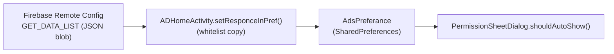
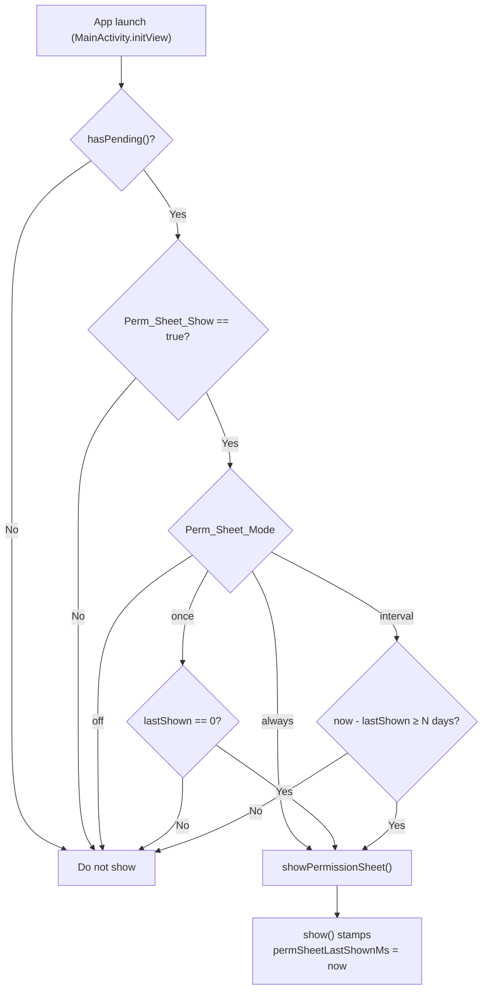
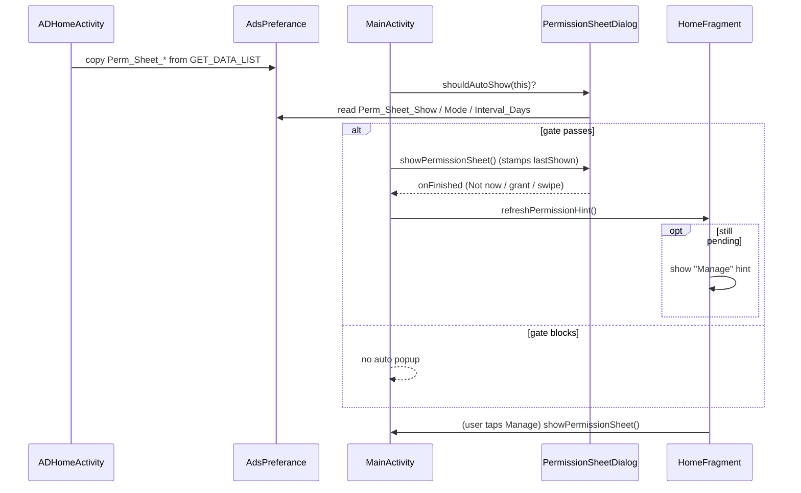

# Permission Bottom-Sheet Flow

How the runtime-permission bottom sheet is shown, gated, and managed — including
the Firebase Remote Config → `AdsPreferance` pipeline that drives its
**On/Off + frequency** behaviour.

---

## 1. Overview

The app primes runtime permissions (notification, phone state, call log,
contacts, overlay) through a single bottom sheet — `PermissionSheetDialog` —
instead of a chain of raw OS dialogs.

There are **two ways** the sheet opens:

| Trigger | Where | Gated by |
|---|---|---|
| **Auto-launch** on app open | `MainActivity.initView()` | `hasPending()` **AND** the Remote-Config frequency gate (`shouldAutoShow`) |
| **Manual "Manage"** tap | Home hint button (`HomeFragment.btnPermManage`) | `hasPending()` only — frequency is ignored |

The frequency gate is what lets you control, from the server, **whether** and
**how often** the sheet pops up by itself — without a new app release.

---

## 2. Components

| File | Role |
|---|---|
| `permission/PermissionSheetDialog.kt` | The sheet. Owns `hasPending()`, `shouldAutoShow()`, `show()`, row visibility, and the permanent-denial logic. |
| `ui/MainActivity.kt` | Auto-launch trigger + `showPermissionSheet()` + the "Manage" hint condition. |
| `ui/home/HomeFragment.kt` | The "Manage" hint (`llPermHint`) and its button. |
| `data/PrefsManager.kt` | Local state — `permSheetLastShownMs` (the frequency clock). |
| `ap_ad_module/domain/AdsPreferance.kt` | SharedPreferences store the RC values land in. |
| `ap_ad_module/presentation/ADHomeActivity.kt` | Splash: parses the `GET_DATA_LIST` RC blob and writes the config keys into `AdsPreferance`. |

---

## 3. Configuration pipeline (Remote Config → AdsPreferance)

The app does **not** use one Remote Config parameter per flag. It ships a single
JSON blob:

- `GET_DATA_LIST` — release builds
- `DEBUG_GET_DATA_LIST` — debug builds

At splash, `ADHomeActivity.setResponceInPref()` parses that JSON and copies a
**whitelist** of keys into `AdsPreferance` (SharedPreferences). The rest of the
app then reads them synchronously via `AdsPreferance.getBoolean/getString/getInt`.



> **Timing:** a config change takes effect on the **next cold start** after the
> fetch succeeds. Release fetch interval is 3600 s; debug is 0 s.

The three permission-sheet keys were added to the boolean / string / int
whitelists in `ADHomeActivity` so they flow through this exact path.

---

## 4. Remote Config parameters

Add these **inside the `GET_DATA_LIST` (and `DEBUG_GET_DATA_LIST`) JSON object**:

```json
"Perm_Sheet_Show": true,
"Perm_Sheet_Mode": "always",
"Perm_Sheet_Interval_Days": 3
```

| Key | Type | Default | Meaning |
|---|---|---|---|
| `Perm_Sheet_Show` | Boolean | `true` | Master **On/Off** for the auto-launch. `false` = never auto-shows (Manage still works). |
| `Perm_Sheet_Mode` | String | `"always"` | Frequency mode: `once` · `always` · `interval` · `off`. |
| `Perm_Sheet_Interval_Days` | Number | `3` | Days to wait between shows — used **only** by `interval`. |

### Modes

| Mode | Behaviour |
|---|---|
| `always` | Auto-shows on **every launch** while something is pending (legacy behaviour). |
| `once` | Auto-shows on the **first eligible launch only**, then never again automatically. |
| `interval` | Auto-shows, then stays quiet for `Perm_Sheet_Interval_Days`, then shows again if still pending. |
| `off` | Never auto-shows (same effect as `Perm_Sheet_Show: false`). |

> Defaults preserve today's behaviour: if nothing is configured, the sheet is
> **On** and in **`always`** mode.

### Copy-paste presets

**Every launch (current behaviour):**
```json
"Perm_Sheet_Show": true,
"Perm_Sheet_Mode": "always"
```

**Only once ever:**
```json
"Perm_Sheet_Show": true,
"Perm_Sheet_Mode": "once"
```

**Re-ask every 3 days while pending:**
```json
"Perm_Sheet_Show": true,
"Perm_Sheet_Mode": "interval",
"Perm_Sheet_Interval_Days": 3
```

**Turn the auto-popup off:**
```json
"Perm_Sheet_Show": false
```

---

## 5. The auto-launch decision (`shouldAutoShow`)



Pseudocode (mirrors `PermissionSheetDialog.shouldAutoShow`):

```text
shouldAutoShow(activity):
    if !hasPending(activity)            -> false
    if !Perm_Sheet_Show (default true)  -> false
    lastShown = PrefsManager.permSheetLastShownMs
    when Perm_Sheet_Mode (default "always"):
        "off"      -> false
        "once"     -> lastShown == 0
        "interval" -> lastShown == 0 || (now - lastShown) >= Interval_Days * 24h
        else       -> true   // "always"
```

- **`hasPending()`** applies to **both** auto-launch and the Manage button.
- **The frequency gate applies to auto-launch only.** The Manage button calls
  `showPermissionSheet()` directly, so it always opens (subject to `hasPending`).

---

## 6. The frequency clock

A single `Long` drives both `once` and `interval`:

- **`PrefsManager.permSheetLastShownMs`** — epoch millis of the last show
  (`0` = never shown).
- Stamped inside `PermissionSheetDialog.show()` on **every** actual show —
  whether triggered automatically or via Manage — so a manual open also resets
  the interval window.

---

## 7. Which rows appear in the sheet

The sheet lists notification / phone state (only when `HD_VBC_Show` is on) /
call log / contacts / overlay. A row is **hidden** when:

| Row type | Hidden when |
|---|---|
| Call log · Contacts · Overlay | Permission is **granted**. |
| Notification · Phone state (engine-managed) | Granted **OR permanently denied** (declined twice from any screen). |

**Permanent denial** (`PermissionSheetDialog.isPermanentlyDenied`) =
the permission is ungranted **and** was requested at least once from anywhere
(`PermissionPrefs.wasAsked` from the engine path, or
`PrefsManager.hasRequestedPermission` from Home's quick-action path) **and**
`shouldShowRequestPermissionRationale` now returns `false`. On Android 11+ that
state is reached after the **2nd decline**.

`hasPending()` also treats those two permissions as resolved once permanently
denied, so the sheet never renders with every row hidden, and `interval` mode
won't keep re-popping for permissions the OS has already locked out.

---

## 8. The Home "Manage" hint

After the sheet is dismissed (**Not now** or swipe) while permissions are still
pending, Home shows a compact hint card (`llPermHint`) with a **Manage** button
that re-opens the sheet.

- Shown when `MainActivity.shouldShowPermissionHint()` =
  `permissionSheetDismissed && PermissionSheetDialog.hasPending(this)`.
- Refreshed in `HomeFragment.initView / onResume / onHiddenChanged`, so it
  auto-hides the moment everything needed is granted.
- The Manage button ignores the frequency gate — a user tap always opens the sheet.

---

## 9. End-to-end sequence



---

## 10. Analytics

- `PermissionSheet_Show` — the sheet was shown.
- `PermissionSheet_NotNow` — the user tapped Not now.
- `Permission_<NAME>_Show / _Allow / _Deny` — per-permission results
  (`POST_NOTIFICATIONS`, `READ_PHONE_STATE`, …).
- `Permission_OVERLAY_Allow / _Deny` — overlay grant result.

---

## 11. Quick reference — files touched

| Concern | Symbol |
|---|---|
| Auto-launch gate | `PermissionSheetDialog.shouldAutoShow()` |
| Show + timestamp stamp | `PermissionSheetDialog.show()` |
| Pending check | `PermissionSheetDialog.hasPending()` |
| Row hide / permanent denial | `PermissionSheetDialog.shouldHideRow()` / `isPermanentlyDenied()` |
| Frequency clock | `PrefsManager.permSheetLastShownMs` |
| RC → prefs sync | `ADHomeActivity.setResponceInPref()` |
| Launch trigger | `MainActivity.initView()` |
| Manage hint | `HomeFragment.refreshPermissionHint()` / `MainActivity.shouldShowPermissionHint()` |
